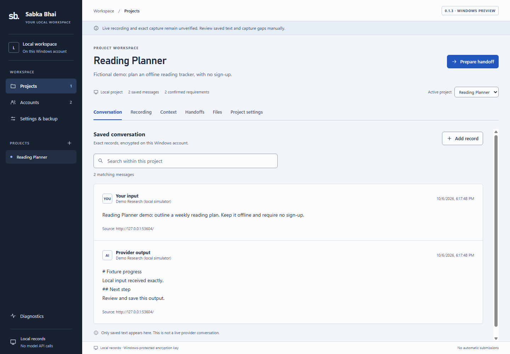
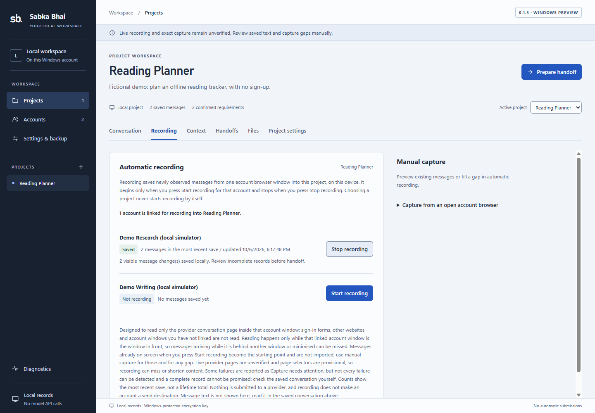
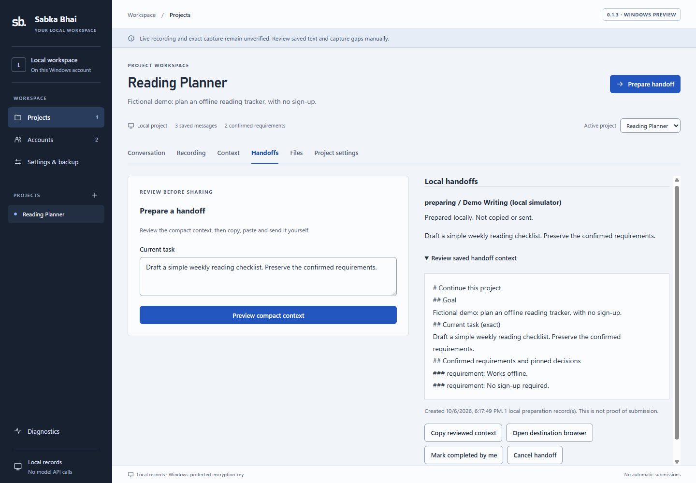

# Sabka Bhai

### Your AI subscriptions. One local workspace.

A Windows desktop application for keeping project context and conversation records together while working across AI subscription websites.

> **Project showcase:** This repository contains documentation and screenshots only. The application source is private; access may be granted on request. No application download is included.

*Actual 0.1.3 application UI with fictional data from the built-in local simulator. No live AI provider is used in these screenshots.*

## Why I built it

Working across AI services often means scattered conversations and repeatedly explaining the same project. Important requirements get buried, and moving to another service can mean rebuilding context from scratch.

Sabka Bhai provides a local workspace for organizing that work. It keeps saved conversations associated with projects and helps prepare reviewed context for the next conversation. You remain in control of signing in, choosing what to share, and sending messages.

## What it does

- **Separate account sessions:** Each account profile has its own browser cookies and website storage, including multiple profiles for the same service.
- **Local project records:** Keep captured messages, confirmed requirements and imported text references together.
- **Optional automatic recording:** Explicitly link an account to a project to save newly observed conversation text while that account's browser window is in front.
- **Manual capture and review:** Preview visible conversation text before saving it, including when filling gaps in automatic recording.
- **Context handoffs:** Assemble confirmed project context and the current task into a reviewable package. Copy it, then paste and send it yourself.
- **Encrypted application records:** Store project records locally with a Windows-protected encryption key, with encrypted backup and recovery workflows.

Account windows open without waiting for the entire website to finish loading, so a slow page does not keep the main workspace busy.

## A workspace organized around the task

Version 0.1.3 introduces graphite navigation, cool-light reading surfaces and separate project tabs: **Conversation, Recording, Context, Handoffs, Files and Project settings**. Accounts, backups and diagnostics have their own screens. Switching tabs changes the view instead of scrolling through unrelated controls.

Search and unfinished form text stay with their project while navigating within the running app. Unsaved drafts are held in memory, not silently written to disk.

## A typical workflow

1. Create a project and add its requirements.
2. Open an account browser and use the website normally.
3. Save useful conversation text through manual capture or explicitly enabled recording.
4. Review the context needed for the next task.
5. Choose an allowed destination, copy the reviewed context, and send it manually.

Saved conversation records remain separate from the compact handoff context. Preparing a shorter handoff does not replace the underlying records.

### Optional local recording

*One demo account is linked to Reading Planner. The status reflects an actual local-simulator save. The count is for the most recent save, not a complete conversation archive.*

### Reviewed context handoff

*The fictional project requirements travel with the next task. This handoff was prepared locally, not copied or sent. The destination is another local-simulator profile.*

## Technical overview

| Area | Technology or approach |
| --- | --- |
| Desktop application | Electron with bundled Chromium |
| Interface | React and TypeScript |
| Local persistence | SQLite with encrypted application records |
| Account separation | Persistent Chromium session partitions |
| Browser isolation | Sandboxing, context isolation and restricted navigation |
| Testing | Unit tests and Playwright-driven Electron tests, including the packaged Windows executable |

The application does not require model API keys or make model API calls. It does not automatically send prompts, rotate accounts or retry provider submissions. Website access remains subject to each provider's subscription and terms.

## Current status

**Windows preview, version 0.1.3.** The latest local verification passed:

| Test layer | Passed |
| --- | ---: |
| Unit tests | 104 |
| Development Electron tests | 24 |
| Packaged-executable tests | 6 |

Checks cover session isolation, recording, backup/recovery, restart durability, browser-loading behavior, tab navigation and draft retention. These results use controlled local fixtures; they do not establish full compatibility with live AI provider websites.

## Important boundaries

- **Recording is not a complete archive.** Earlier history, background activity and content absent from the page can be missed. Live-page extraction remains provisional; review saved text and capture gaps manually.
- **Account labels are not verified identities.** Confirm the signed-in website account before recording.
- **Encryption has a defined scope.** It applies to application records. Browser profiles, clipboard contents and plaintext exports have separate privacy boundaries. Anything sent to a provider leaves the device.
- **This is a preview.** The Windows build is unsigned. No executable is distributed through this showcase.

## Source access

The implementation is private. Source-code review or a walkthrough may be arranged on request through the contact details supplied with my resume or portfolio. Access is granted selectively.
